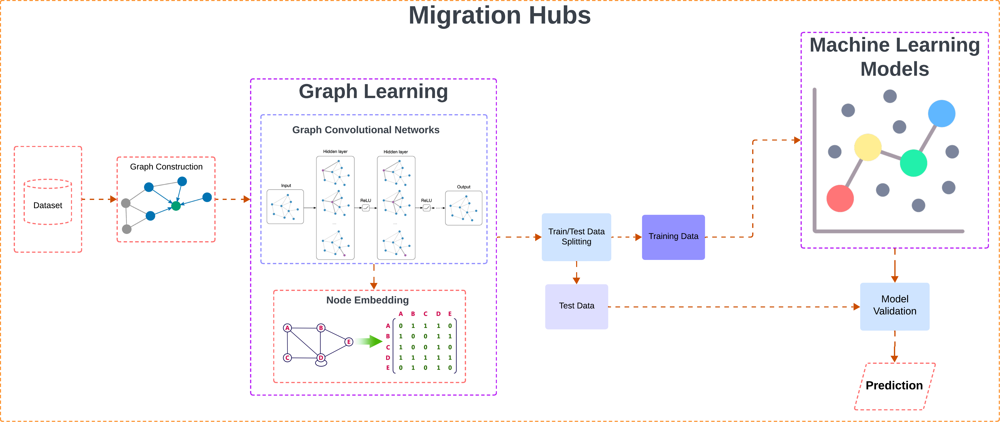

# Identifying Global Migration Hubs through Spatial Machine Learning and Network Science

## Team Information

- Name: Porimol Chandro (p.chandro@student.uw.edu.pl)
- Anastasiia Sviridova (a.sviridova@student.uw.edu.pl)

## Project File Structure

```bash
.
├── dataset
│   ├── ...
├── images
│   ├── ...
├── gephi-project.gephi
├── python_code
│   ├── data-processing.ipynb
│   └── node-classification-with-cluster-gcn.ipynb
├── r_code
└── └── node-classification-with-cluster-gcn.R
└── README.md
```

### File Structure Overview

- **dataset/:** This folder contains raw or processed datasets used for analysis or modeling.
- **images/:** Plots, graphs, and network diagrams (e.g., used in the report).
- **python_code/:** Main logic for machine learning and GCN modeling.
    - **data-processing.ipynb:** Jupyter notebook for cleaning, transforming, and preparing migration data.
    - **node-classification-with-cluster-gcn.ipynb:** Jupyter notebook implementing GCN for migration hub classification.
- **r_code/:**
    - **node-classification-with-cluster-gcn.R:** R script (or notebook) that possibly performs a similar analysis or alternative view in R.
- **gephi-project.gephi:** A Gephi project file for visualizing and analyzing migration networks.
- **README.md:** Project overview, instructions, and references for running the code and understanding the project.

## Architecture Diagram


